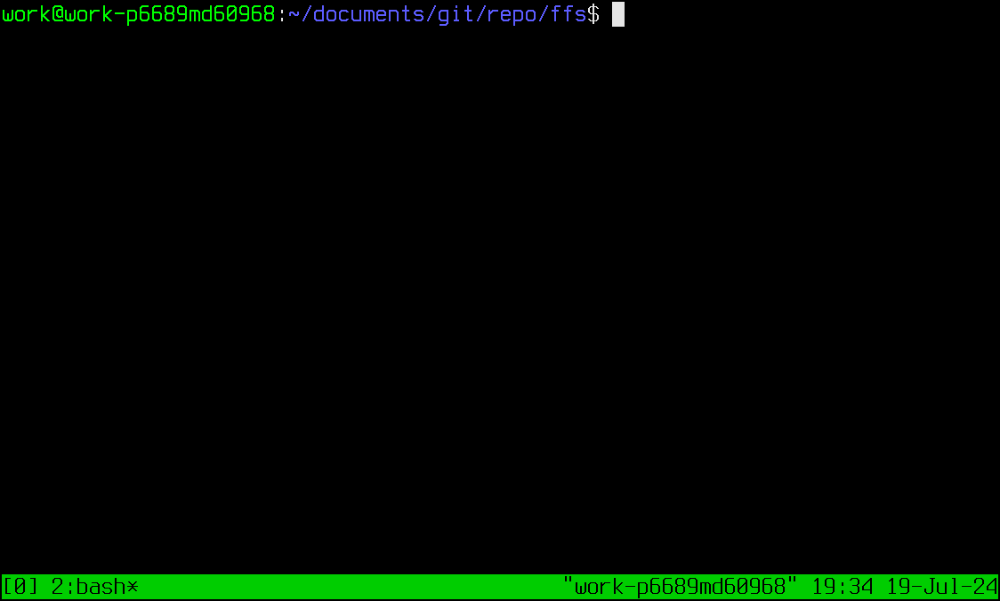

# Simple Forth File System based upon the BLOCK word-set

* Author: Richard James Howe
* Email: <mailto:howe.r.j.89@gmail.com>
* License: The Unlicense / Public Domain
* Repo: <https://github.com/howerj/ffs>

This is a simple Forth block based file system. See the Forth
file [ffs.fth][] for more information including documentation. 

The file system provides a word-set that allows a user to
interact with a disk image like you would with a
[DOS][] based system.

This project works under <https://gforth.org/> and also 
SUBLEQ eForth (see <https://github.com/howerj/subleq>).

Some quick notes and limitations:

* Files consist of *non-contiguous* Forth Blocks.
* Files still consist of Forth Blocks, so are multiples of
1024 bytes in size.
* The maximum file system size is roughly 64MiB.
* The maximum number of files per directory is 31.
* The file system is reliant on the Forth Block word-set and 
should run on even the most spartan Forth system so long as it 
is present.
* File names are limited to 16 bytes in size.
* Some commands include; `edit`, `exe`, `ls`, `rm`, `rmdir`, 
`mkdir`, `cd`, `pwd`, `tree`, `cp`, `rename`, `cat`, `hexdump`, 
`more`, `df`, `halt`, `fdisk`, and `stat`.
* Full file path parsing is not available and most commands
operate only using the current working directory. For example 
you cannot `rm a/b/c`, you would need to `cd a`, `cd b` and 
then call `rm c`. This is not a limitation of the file system
but the tools built upon it. Some utilities can parse "." for
the current directory and ".." for the next directory up such
as "mv" and "cd" but most cannot.
* The file system is designed to run as a single user system,
there is no locking and global variables are used.
* Only one file system can be mounted at a time.
* Some commands are line oriented, others have block oriented
analogues such as "cat" (line oriented) and "bcat" (block
oriented). The block oriented utilities expect the files
given to them to formatted as a Forth Block would be.
* There is no redundant FAT block data structure like in 
FAT-12/FAT-16/FAT-32.
* Low memory usage: The file system uses kilobytes of data
(and can be further reduced if features like editing are not
required). A handful of variables and buffers are used, along
with the Forth Block system (a Block System with a single buffer
would work).

## Examples

The following section contains a few examples of how to use
the file system and associated commands. To run the SUBLEQ
eForth examples you will need [make][] and a [C compiler][]
installed and on your [PATH][].

### GForth

An example session:

	mkdir example
	cd example
	pwd
	edit test.fth \ Start editor commands
	+ .( FIRST BLOCK ) cr
        + .( FIRST BLOCK, SECOND LINE ) cr
	n
	+ .( SECOND BLOCK ) cr
	s
	q     \ Back to "DOS"
	ls
	exe test.fth
	df
	rm test.fth
	ls

### SUBLEQ eForth

To run the SUBLEQ eForth system you will need to type:

	make disk

This will make a bootable disk image that will work with
the SUBLEQ VM. It will take a while to do so.

Instead of saving to a file called `ffs.fb` the disk image
`disk.dec` will be updated after exiting from the SUBLEQ
VM cleanly.

The SUBLEQ VM File System can only allocate from a pool of
about 61 blocks, there are special files that are created,
such as `[KERNEL]` that allow file system access to the SUBLEQ 
eForth image.

## Example Sessions

An example session recorded with [ttyrec][] (all shorter than 
they should be because of problems converting the recording
to a GIF):

And another:

And another:

## References

* <https://github.com/howerj/subleq>
* <https://en.wikipedia.org/wiki/File_Allocation_Table>

[ffs.fth]: ffs.fth
[DOS]: https://en.wikipedia.org/wiki/DOS
[make]: https://www.gnu.org/software/make/
[C Compiler]: https://gcc.gnu.org/
[PATH]: https://en.wikipedia.org/wiki/PATH_(variable)
[ttyrec]: https://en.wikipedia.org/wiki/Ttyrec
